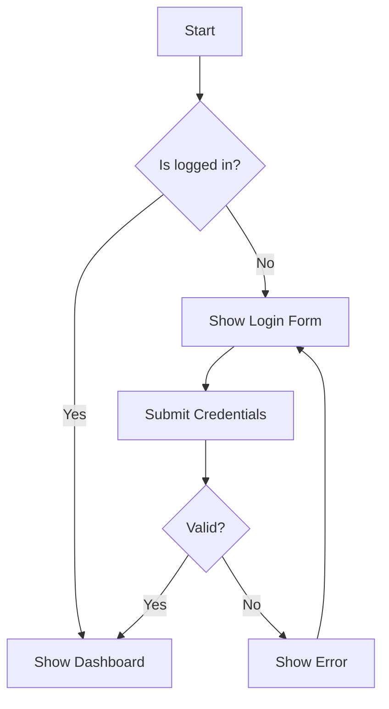

# User Login Flow

```mermaid
flowchart TD
    A[Start] --> B{Is logged in?}
    B -->|Yes| C[Show Dashboard]
    B -->|No| D[Show Login Form]
    D --> E[Submit Credentials]
    E --> F{Valid?}
    F -->|Yes| C
    F -->|No| G[Show Error]
    G --> D
```
