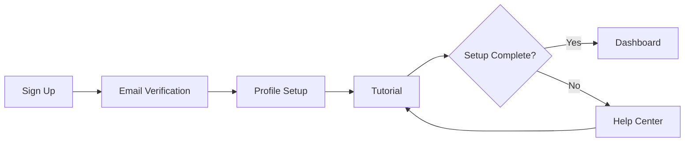

# Quarterly Report

This report summarizes the Q1 2025 performance across all departments.

## Revenue by Department

| Department | Q1 Revenue | Q1 Target | % Achieved |
|:-----------|:----------:|:---------:|-----------:|
| Engineering | $2.4M | $2.0M | 120% |
| Marketing | $1.8M | $2.2M | 82% |
| Sales | $3.1M | $2.8M | 111% |
| Support | $0.9M | $1.0M | 90% |

## Customer Onboarding Flow

The following diagram shows our current onboarding process:

## Next Steps

Based on the results above, we recommend:
1. Increasing marketing budget allocation
2. Expanding the sales team in Q2
3. Automating the onboarding tutorial step
